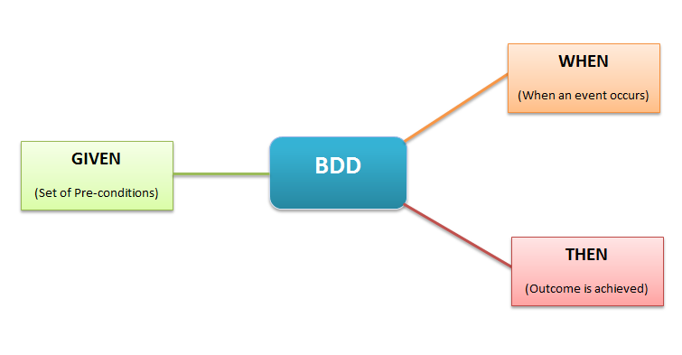
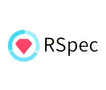
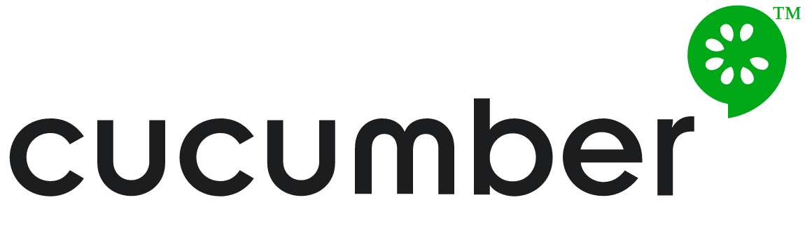
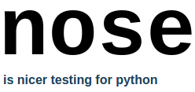
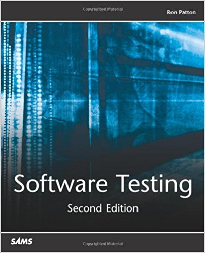
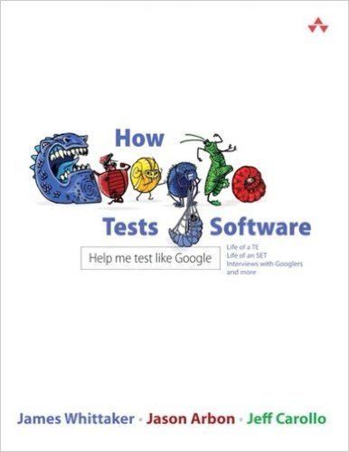

Software Testing
===
##### Test well, sleep well

###### Icaro Seara ( [@icaroseara](https://github.com/icaroseara) )

---
# The starting point for improvement is to recognize the need.
<smal>Masaaki Imai</smal>

---
# What is software testing?
 The proccess of verifying software to **ensure it works as expected**

---
# Why software testing is important?
- To prove that your **code satisfies requirements**
- To **catch bugs faster**, before software is out in the field
- To garantee if a unit of **code still works after it is modified**
---
# Testing methods
- **Unit testing** - <small>validate the smallest components of the system</small>
- **Functional testing** - <small>validate the features of the software and ensure that a set of components play nicely.</small>
- **Integration testing** - <small>multiple software modules are tested together to verify their communications with each other.</small>
--- 
# Software testing practices
- TDD
 
- BDD
 
---
# Tools: testing frameworks
- Ruby - -  
- Java -  - 
- Javascript - 
- Python -  - **Lettuce**
---
# Online courses
- [Testing with Agile](https://www.coursera.org/learn/uva-darden-agile-testing)   + 
- [Software Testing - <smal>How to Make Software Fail</smal>](https://in.udacity.com/course/software-testing--cs258/) 
- [Javascript Testing <smal>- Developing Apps with Confidence</smal>](https://in.udacity.com/course/javascript-testing--ud549/) 
---
# Recomended books

<small>by Ron Patton</small>

<small>by James Whittaker, Json Arbo and Jeff Carollo</small>

---
# Next steps
- Workshop
- Coding dojo :heart:
- Cups of testing :coffee: 
- Slack channel: `#software-testing`
- Lets do it!
---
# Extra resources
- [github.com/atinfo/awesome-test-automation](https://github.com/atinfo/awesome-test-automation/)
- [github.com/ligurio/free-software-testing-books](https://github.com/ligurio/free-software-testing-books/)
- [github.com/dwyl/learn-tdd](https://github.com/dwyl/learn-tdd)
- [speakerdeck.com/rorcraft/how-google-tests-software](https://speakerdeck.com/rorcraft/how-google-tests-software)
- [atlassian.com/software-testing](https://www.atlassian.com/software-testing)

---
## Happy testing! :+1:

### [github.com/icaroseara/software-testing](https://github.com/icaroseara/software-testing)

